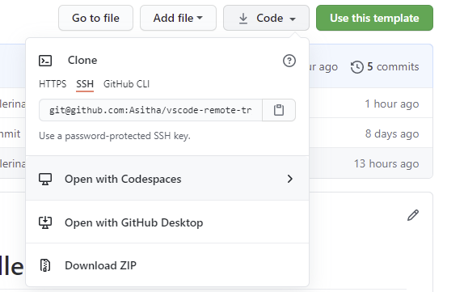
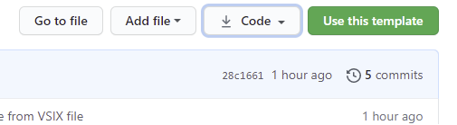
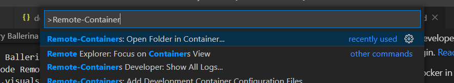

# VSCode Ballerina Development Container


A development container is a running Docker container with a well-defined tool/runtime stack and its prerequisites. You can try out development containers with [GitHub Codespaces](https://github.com/features/codespaces) or [Visual Studio Code Remote - Containers](https://aka.ms/vscode-remote/containers).

This is a template project for Ballerina language with VS Code development containers.

## Setting up the development container

## Open in Github Codespaces
Follow these steps to open this sample in a Codespace:

1. Click the Code drop-down menu and select the Open with Codespaces option.

2. Select + New codespace at the bottom on the pane.

For more info, check out the [GitHub documentation](https://docs.github.com/en/free-pro-team@latest/github/developing-online-with-codespaces/creating-a-codespace#creating-a-codespace).


## VS Code Remote - Containers

Follow these steps to open this sample in a container using the VS Code Remote - Containers extension:

1. If this is your first time using a development container, please ensure your system meets the pre-reqs (i.e. have Docker installed) in the [getting started steps](https://aka.ms/vscode-remote/containers/getting-started).

1. Use this template repository to create a Ballerina project repository 
  
2. Clone the newly created repository to your local filesystem.
3. Press <kbd>F1</kbd> and select the **Remote-Containers: Open Folder in Container...** command.
 
4. Select the cloned copy of this folder, wait for the container to start, and try things out!

## Create a Ballerina project

To create a Ballerina project open up the terminal in VSCode (`Terminal -> New Terminal` ). Then use the following command to create your Ballerina project.

```bash
$ bal init
```
Create a Ballerina module with
```bash
$ bal add <module_name>
```
----

## Using a specific container with an older Ballerina version

Update the .devcontainer/devcontainer.json file to switch the Ballerina version of the container

```json
{
	"name": "Ubuntu",
	"build": {
		"dockerfile": "Dockerfile",
		"args": { "VARIANT": "<IMAGE_TAG_GOES_HERE>" }
	},
...
```

You can check the docker hub [ballerina-dev](https://hub.docker.com/repository/docker/asithan/ballerina-dev/tags?page=1&ordering=last_updated) registry for released Ballerina dev containers. 

> NOTE: Base docker image for the dev container is maintained at [VS Code Remote Ballerina-Dev Docker](https://github.com/Asitha/vscode-remote-ballerina-dev-container) repository.


